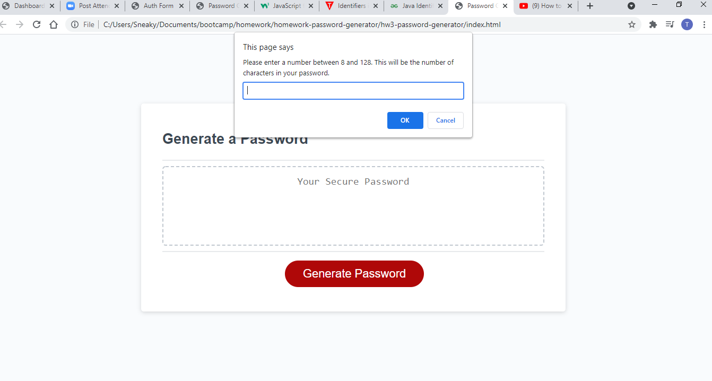

# hw3-password-generator

Objective: This assignment was made for us to make a password generator using javascript tools we have learned in class. It is supposed to use the prompt alert and confirm functions to help someone generate a random password for security reasons. 

Outline: This is a working password generator that will give you a generated password after you select the different character options that are preset for you to select from. Such as upper, lower case letters, numbers and special characters. 

URL: (https://thomasseifert1.github.io/hw3-password-generator/)

